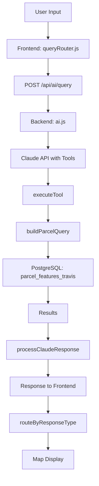

# SCOUTGPT COMPLETE SYSTEM INTEGRATION AUDIT

**Date:** January 2025  
**Purpose:** Complete technical audit for integration planning  
**Repositories Audited:**
- Backend: `~/scoutgptpro-backend`
- Frontend: `~/scoutgpt_9461`

---

## Table of Contents

1. [Database Schema](#section-1-database-schema)
2. [Backend Data Flow](#section-2-backend-data-flow)
3. [Backend Routes](#section-3-backend-routes)
4. [Frontend Data Flow](#section-4-frontend-data-flow)
5. [AI Integration](#section-5-ai-integration)
6. [Existing Spatial Capabilities](#section-6-existing-spatial-capabilities)
7. [Data Pipelines](#section-7-data-pipelines)
8. [Integration Points](#section-8-integration-points)
9. [Gaps & Recommendations](#section-9-gaps--recommendations)

---

# SECTION 1: DATABASE SCHEMA

## 1.1 All Tables with Row Counts

| Table Name | Row Count | Description |
|------------|-----------|-------------|
| parcel_features_travis | 369,813 | Primary AI query table (Travis County) |
| parcels_travis | 372,826 | Parcel geometries (MultiPolygon) |
| parcels_travis_enrichment | 369,813 | TCAD enrichment data |
| properties | 352,431 | ATTOM property data (legacy) |
| owners | 85,579 | Owner entities |
| owner_properties | 100,000 | Owner-Property junction table |
| opportunities | 0 | Opportunity scoring (empty) |
| signals | 0 | Distress signals (empty) |
| gis_layers | 10 | GIS layer definitions |
| map_server_registry | 416 | ArcGIS REST service registry |
| layer_sets | 32 | Layer set configurations |
| deals | 2 | CRM deals |
| deal_rooms | 2 | Deal rooms |
| listings | 7 | Property listings |

**Core Tables:**
- `parcel_features_travis` - Main query table for AI searches
- `parcels_travis` - Geometry storage (MultiPolygon)
- `parcels_travis_enrichment` - Enrichment data from TCAD

**Feature Tables:**
- `opportunities` - Opportunity scoring (FK: parcel_features_travis.parcel_id)
- `signals` - Distress signals (FK: parcel_features_travis.parcel_id)

**Junction Tables:**
- `owner_properties` - Links owners to parcels
- `xref_parcel_property_travis` - Links parcels to ATTOM properties

**GIS Tables:**
- `gis_layers` - Layer definitions
- `map_server_registry` - ArcGIS REST services
- `layer_sets` - Layer set configurations
- `zoning_districts` - Zoning boundaries
- `gis_floodplain_austin` - Flood zones
- `gis_water_ccn`, `gis_sewer_ccn` - Utility CCNs

**CRM Tables:**
- `deals` - CRM deals/pipeline
- `deal_rooms` - Deal room data
- `listings` - Property listings

## 1.2 parcel_features_travis Complete Schema

### All Columns with Data Types

| Column Name | Data Type | Nullable | Default | Description |
|-------------|-----------|----------|---------|-------------|
| parcel_id | TEXT | NO | - | Primary key |
| county_fips | TEXT | NO | '48453' | County FIPS code |
| situs_address | TEXT | YES | - | Property address |
| mailing_address | TEXT | YES | - | Owner mailing address |
| mail_city | TEXT | YES | - | Mailing city |
| mail_state | TEXT | YES | - | Mailing state |
| mail_zip | TEXT | YES | - | Mailing ZIP |
| owner_name_raw | TEXT | YES | - | Raw owner name |
| owner_name_norm | TEXT | YES | - | Normalized owner name |
| owner_entity_type | TEXT | YES | - | person/llc/corp/trust_estate |
| owner_portfolio_count_travis | INTEGER | YES | 0 | Owner's parcel count |
| owner_segment | TEXT | YES | - | mom_pop/small_operator/institutional/local_owner/absentee |
| acres_calc | NUMERIC | NO | - | Calculated acreage |
| acres_calc_source | TEXT | NO | 'enrichment.acreage' | Source of acreage |
| acres_calc_confidence | NUMERIC | YES | 1.0 | Confidence score |
| asset_class | TEXT | YES | - | residential/commercial/land/industrial/mixed/unknown |
| asset_class_confidence | NUMERIC | YES | - | Confidence score |
| year_built | INTEGER | YES | - | Year built |
| building_sqft | NUMERIC | YES | - | Building square footage |
| market_value | NUMERIC | YES | - | Market value |
| assessed_total_value | NUMERIC | YES | - | Assessed value |
| land_value | NUMERIC | YES | - | Land value |
| improvement_value | NUMERIC | YES | - | Improvement value |
| tax_delinquent_flag | BOOLEAN | YES | false | Tax delinquent |
| homestead_exemption_flag | BOOLEAN | YES | false | Homestead exemption |
| last_sale_date | DATE | YES | - | Last sale date |
| last_sale_price | NUMERIC | YES | - | Last sale price |
| zoning_code | TEXT | YES | - | Zoning code |
| flood_zone | TEXT | YES | - | Flood zone |
| land_use_code | TEXT | YES | - | Land use code |
| land_use_desc | TEXT | YES | - | Land use description |
| geom_centroid | GEOMETRY(Point, 4326) | YES | - | Centroid point |
| created_at | TIMESTAMPTZ | NO | now() | Created timestamp |
| updated_at | TIMESTAMPTZ | NO | now() | Updated timestamp |

### All Indexes

| Index Name | Type | Columns | Purpose |
|------------|------|---------|---------|
| parcel_features_travis_pkey | UNIQUE BTREE | parcel_id | Primary key |
| idx_pft_geom | GIST | geom_centroid | Spatial queries |
| idx_pft_asset_class | BTREE | asset_class | Asset class filtering |
| idx_pft_owner_entity_type | BTREE | owner_entity_type | Owner type filtering |
| idx_pft_owner_segment | BTREE | owner_segment | Owner segment filtering |
| idx_pft_acres | BTREE | acres_calc | Acreage filtering |
| idx_pft_market_value | BTREE | market_value | Value filtering |
| idx_pft_county_acres | BTREE | county_fips, acres_calc | Composite filter |
| idx_pft_owner_name | GIN | to_tsvector(owner_name_raw) | Full-text search |
| idx_pft_tax_delinquent | BTREE | tax_delinquent_flag | WHERE tax_delinquent_flag = true |

### Sample Row

```json
{
  "parcel_id": "860761",
  "county_fips": "48453",
  "situs_address": ", TX 78738",
  "owner_name_raw": "MOREHOUSE LYNN D 2015 REVOCABLE TRUST",
  "owner_entity_type": "trust_estate",
  "owner_segment": "trust_estate",
  "acres_calc": "1.71457487",
  "asset_class": "unknown",
  "market_value": "46192.00000000",
  "assessed_total_value": "502375.00",
  "tax_delinquent_flag": false,
  "homestead_exemption_flag": false
}
```

### Relationships

**parcel_features_travis → parcels_travis:**
- Join: `parcel_features_travis.parcel_id = parcels_travis.parcel_id`
- Purpose: Get full geometry (MultiPolygon) from centroid

**parcel_features_travis → parcels_travis_enrichment:**
- Join: `parcel_features_travis.parcel_id = parcels_travis_enrichment.parcel_id`
- Purpose: Additional enrichment fields

**parcel_features_travis → opportunities:**
- FK: `opportunities.parcel_id → parcel_features_travis.parcel_id`
- Cascade: ON DELETE CASCADE

**parcel_features_travis → signals:**
- FK: `signals.parcel_id → parcel_features_travis.parcel_id`
- Cascade: ON DELETE CASCADE

## 1.3 Foreign Key Relationships

### Prisma Schema Relationships

**User → UserProfile:**
- `UserProfile.userId → User.id` (1:1, CASCADE)

**Property → Listing:**
- `Listing.propertyId → Property.id` (1:many)

**Property → Deal:**
- `Deal.propertyId → Property.id` (1:many)

**Owner → OwnerProperty:**
- `OwnerProperty.ownerId → Owner.id` (1:many, CASCADE)

**parcel_features_travis → opportunities:**
- `opportunities.parcel_id → parcel_features_travis.parcel_id` (1:1, CASCADE)

**parcel_features_travis → signals:**
- `signals.parcel_id → parcel_features_travis.parcel_id` (1:many, CASCADE)

**County Parcel Tables:**
- `parcels_*_enrichment.parcel_id → parcels_*.parcel_id` (1:1, NO ACTION)

### Complete Prisma Schema

See: `prisma/schema.prisma` (1689 lines)

Key models:
- User, UserProfile
- Property (83 fields)
- Listing, Deal, DealRoom
- Owner, OwnerProperty, OwnerFeaturesTx
- parcel_features_travis (34 fields)
- opportunities, signals
- GisLayer, MapServerRegistry, LayerSet

## 1.4 Prisma Schema Models

**File:** `prisma/schema.prisma`

**Key Models:**
- `User` - User accounts
- `Property` - ATTOM property data (83 fields)
- `parcel_features_travis` - Primary query table (34 fields)
- `opportunities` - Opportunity scoring
- `signals` - Distress signals
- `Owner` - Owner entities
- `GisLayer`, `MapServerRegistry`, `LayerSet` - GIS layers
- `Deal`, `DealRoom` - CRM tables

---

# SECTION 2: BACKEND DATA FLOW

## 2.1 AI Query Flow - Complete Path

### Route: POST /api/ai/query

**File:** `src/routes/ai.js`

**Flow:**
1. Request arrives at `router.post('/query', ...)`
2. Validates request with `validateAiQueryRequest()`
3. Creates database pool: `getDbPool()` (max 5 connections)
4. Calls Claude API with tools:
   - Model: `claude-sonnet-4-20250514`
   - System prompt: `UNIFIED_SYSTEM_PROMPT`
   - Tools: `AI_TOOLS` array
5. Processes response with `processClaudeResponse()`
6. Executes tools via `executeTool()`
7. Returns standardized response

### AI_TOOLS Array (Complete)

See file: `src/routes/ai.js:23-218`

**4 Tools Defined:**
1. `search_properties` - Property search with filters
2. `toggle_gis_layer` - GIS layer toggle commands
3. `search_pois` - POI search
4. `get_property` - Single property lookup

**Full tool schemas:** See `src/routes/ai.js:23-218` for complete input_schema definitions.

### buildParcelQuery() Function (Complete)

**Location:** `src/routes/ai.js:787-974`

**Function Signature:**
```javascript
function buildParcelQuery(intent) {
  // Normalizes filter values to lowercase
  // Builds parameterized SQL query
  // Returns: { query: string, values: array, sql: string (debug) }
}
```

**SQL Generated:**
```sql
SELECT
  parcel_id,
  situs_address,
  owner_name_raw,
  owner_entity_type,
  owner_segment,
  acres_calc,
  asset_class,
  market_value,
  tax_delinquent_flag,
  homestead_exemption_flag,
  mail_zip,
  county_fips,
  ST_AsGeoJSON(geom_centroid)::json as geom
FROM parcel_features_travis
WHERE [conditions]
ORDER BY acres_calc
LIMIT $N
```

**Filters Supported:**
- `county_fips` - Exact match
- `bbox` - `ST_Intersects(geom_centroid, ST_MakeEnvelope(...))`
- `acres_min`, `acres_max` - Numeric range
- `asset_class` - Single value or array (OR condition)
- `owner_entity_type` - Single value or array (OR condition)
- `owner_segment` - Single value or array (OR condition)
- `tax_delinquent` - Boolean
- `homestead_exemption` - Boolean
- `market_value_min`, `market_value_max` - Numeric range
- `owner_name_search` - `ILIKE '%search%'`
- `address_search` - `ILIKE '%search%'`

**How SQL is Generated:**
1. Normalizes filter values to lowercase
2. Builds conditions array with parameterized placeholders ($1, $2, ...)
3. Joins conditions with `AND`
4. Appends ORDER BY and LIMIT
5. Returns query string and values array

**Full Code:** See `src/routes/ai.js:787-974`

## 2.2 Intent Classification

### intentExtractor.js

**File:** `src/services/intentExtractor.js`

**Purpose:** Extracts DiscoverIntent JSON from natural language queries for the Discovery engine.

**Key Function:**
```javascript
export async function extractDiscoverIntent(queryText, anthropicClient) {
  // Uses Claude 3.5 Sonnet to extract structured intent
  // Returns: { assetTypes, geo, hardFilters, ownerSegment, softPreferences, requiredSignals, limit }
}
```

**Note:** This is separate from the main AI query flow. The main AI endpoint (`/api/ai/query`) uses Claude's tool calling directly, not this extractor.

### Claude Tool Selection

**How Claude determines which tool to call:**
1. Claude receives `UNIFIED_SYSTEM_PROMPT` with tool descriptions
2. User query is sent as message content
3. Claude analyzes query and calls appropriate tool(s)
4. Tool results are returned to Claude
5. Claude generates final response

**System Prompt:** See `src/routes/ai.js:569-651` (`UNIFIED_SYSTEM_PROMPT`)

**Key Instructions:**
- Property searches → use `search_properties`
- Layer commands → use `toggle_gis_layer`
- POI searches → use `search_pois`
- Specific property lookup → use `get_property`
- ZIP codes → Use `zip_code` field, NOT `bbox` field
- All filter values MUST be lowercase

## 2.3 Property Resolution Flow

### Route: GET /api/properties/resolve?parcelId=...

**File:** `src/routes/properties.js:107-156`

**Flow:**
1. Validates parcelId format (6-digit numeric string)
2. Queries `properties` table by `parcelId`
3. Resolves ATTOM GeoJSON ID via `getAttomGeoIdByParcelId()`
4. Returns: `{ parcelId, propertyId, attomId, attomGeoId, attomConflict, attomGeoIdSource }`

### parcelId → propertyId Resolution

**Relationship:**
- `properties.parcelId` (unique) → `properties.id` (propertyId)
- One parcelId can map to one propertyId
- Not all parcels have propertyId (ATTOM data may not exist)

**Service:** `src/services/attom-resolver-service.js`
- `getAttomGeoIdByParcelId(parcelId)` - Resolves to 32-hex GeoJSON ID
- Uses `xref_parcel_property_travis` table

### parcel_features_travis → properties Relationship

**No direct foreign key.** Relationship is:
- `parcel_features_travis.parcel_id` = `properties.parcelId`
- Join is done manually in queries
- Not all parcels have properties (ATTOM data)

## 2.4 All Services in src/services/

### attom-resolver-service.js
**Purpose:** Resolves parcelId to ATTOM GeoJSON IDs
**Key Functions:**
- `getAttomGeoIdByParcelId(parcelId)` - Returns 32-hex GeoJSON ID
- `attachAttomGeoIdsToProperties(properties)` - Adds attomGeoId to property objects

### category-mapper.js
**Purpose:** Maps GIS layer categories
**Key Functions:**
- `extractCategories(query)` - Extracts GIS categories from query

### countyResolver.js
**Purpose:** Resolves parcelId to county table information
**Key Functions:**
- `resolveParcelCounty(parcelId)` - Returns county info (fips, name, table, enrichment)
- Uses cache to avoid repeated queries
- Queries all county tables until match found

### discoverEngine.js
**Purpose:** Discovery engine for property discovery queries
**Key Functions:**
- Uses `intentExtractor.js` to extract intent
- Executes discovery queries

### intentExtractor.js
**Purpose:** Extracts DiscoverIntent JSON from natural language
**Key Functions:**
- `extractDiscoverIntent(queryText, anthropicClient)` - Returns structured intent

### mapserver-service.js
**Purpose:** Searches MapServers and fetches GeoJSON features
**Key Functions:**
- `searchMapServers({ query, bounds, categories, maxResults })` - Searches registry and fetches features

### mcp-client.js
**Purpose:** MCP (Model Context Protocol) client for property queries
**Key Functions:**
- Various MCP tool implementations (deprecated in favor of direct AI tools)

### property-service.js
**Purpose:** Query properties from parcel chunks (legacy)
**Key Functions:**
- `queryProperties({ bounds, query, mode, limit })` - Queries chunk files
- `needsPropertyData(query, mode)` - Checks if query needs property data

### sqlcoder.js
**Purpose:** Text-to-SQL generation via Replicate API
**Key Functions:**
- `generateSQL(question, customSchema)` - Generates SQL from natural language
- `isComplexQuery(query)` - Checks if query should use SQLCoder

### zipCodeResolver.js
**Purpose:** Resolves ZIP codes and city names to bounding boxes
**Key Functions:**
- `resolveZipToBbox(zipCode)` - Returns [minLng, minLat, maxLng, maxLat]
- `resolveCityToBbox(cityName)` - Returns bbox for city
- `preprocessToolInput(toolInput)` - Resolves ZIP codes in tool input

### Service Call Graph

```
ai.js (routes)
  ├─> zipCodeResolver.js (preprocessToolInput)
  ├─> property-service.js (needsPropertyData - deprecated)
  └─> executeTool() (internal)
      ├─> executeSearchProperties() → buildParcelQuery()
      ├─> executeToggleGisLayer() (returns command)
      ├─> executeSearchPois() (queries osm_pois_travis)
      └─> executeGetProperty() (queries parcel_features_travis)

properties.js (routes)
  ├─> countyResolver.js (resolveParcelCounty)
  └─> attom-resolver-service.js (getAttomGeoIdByParcelId)
```

## 2.5 Geography Resolution

### countyResolver.js

**File:** `src/services/countyResolver.js`

**How it works:**
1. Checks cache first (parcelId → county info)
2. Queries each county table until match found
3. Starts with Travis (most common) for performance
4. Caches result for future lookups

**County Tables:**
- Travis (48453) - parcels_travis
- Williamson (48491) - parcels_williamson
- Hays (48209) - parcels_hays
- Bastrop (48021) - parcels_bastrop
- ... (12 total counties)

### zipCodeResolver.js

**File:** `src/services/zipCodeResolver.js`

**How it works:**
1. Static lookup table `TRAVIS_ZIP_BBOXES` maps ZIP → bbox
2. `resolveZipToBbox(zipCode)` returns [minLng, minLat, maxLng, maxLat]
3. `preprocessToolInput()` automatically resolves ZIP codes in tool input
4. Also supports city names via `TRAVIS_CITY_BBOXES`

**ZIP Code Resolution:**
- ZIP codes in `zip_code` field → resolved to `bbox` automatically
- ZIP codes in `bbox` field (string) → also resolved
- City names → resolved to bbox

### bbox/Geometry Filtering

**Where Applied:**
- `buildParcelQuery()` - Uses `ST_Intersects(geom_centroid, ST_MakeEnvelope(...))`
- `parcels-search.js` - Uses `ST_Intersects(pt.geom, ST_MakeEnvelope(...))`
- `gis.js` - Uses `ST_Intersects(geometry, ST_MakeEnvelope(...))`
- `query.js` - Uses `ST_Within(geom, ST_GeomFromGeoJSON(...))`

**PostGIS Functions Used:**
- `ST_Intersects()` - Checks if geometries intersect
- `ST_MakeEnvelope(minLng, minLat, maxLng, maxLat, 4326)` - Creates bounding box
- `ST_Within()` - Checks if geometry is within polygon
- `ST_DWithin()` - Checks if geometry is within distance

---

# SECTION 3: BACKEND ROUTES

## 3.1 All Route Files

### ai.js
**Endpoints:**
- `POST /api/ai/query` - Main AI query endpoint (rate limited: 30/15min)
- `POST /api/ai/sql` - Direct SQLCoder endpoint

**What it does:**
- Handles natural language queries
- Calls Claude with tools
- Executes tools and returns results

**Database Tables:**
- `parcel_features_travis` (via buildParcelQuery)
- `osm_pois_travis` (via executeSearchPois)

**Services Used:**
- zipCodeResolver, property-service (deprecated)

### boundaries.js
**Endpoints:** (Not detailed in audit)

### buyboxes.js
**Endpoints:** (Not detailed in audit)

### buyerAssumptions.js
**Endpoints:** (Not detailed in audit)

### dealRoomAccess.js
**Endpoints:** (Not detailed in audit)

### dealRoomDocuments.js
**Endpoints:** (Not detailed in audit)

### dealRooms.js
**Endpoints:** (Not detailed in audit)

### deals.js
**Endpoints:** (Not detailed in audit)

### discover.js
**Endpoints:** (Not detailed in audit)

### documents.js
**Endpoints:** (Not detailed in audit)

### export.js
**Endpoints:**
- Queries `parcel_features_travis` for exports

### geocode.js
**Endpoints:** (Not detailed in audit)

### gis.js
**Endpoints:**
- `GET /api/gis/layers` - Get GIS layers
- `POST /api/gis/layers` - Handle layer toggle actions
- `GET /api/gis/layers/:id/query` - Query specific layer
- `GET /api/gis/local/:layerName/geojson` - Query imported GIS layers

**Database Tables:**
- `map_server_registry`
- `gis_layers`
- `gis_water_ccn`, `gis_sewer_ccn`, `gis_floodplain_austin`, etc.

**Spatial Queries:**
- Uses `ST_Intersects(geometry, ST_MakeEnvelope(...))` for bbox filtering

### listings.js
**Endpoints:** (Not detailed in audit)

### mapservers.js
**Endpoints:** (Not detailed in audit)

### mts.js
**Endpoints:**
- Uses `ST_Intersects()` for spatial queries

### osm-pois.js
**Endpoints:**
- Queries `osm_pois_travis` table
- Uses `ST_DWithin()` for distance queries

### parcels-search.js
**Endpoints:**
- `GET /api/parcels/search?bbox=...` - Search parcels with bbox and filters

**Database Tables:**
- `parcels_travis`
- `parcels_travis_enrichment`

**Spatial Queries:**
- Uses `ST_Intersects(pt.geom, ST_MakeEnvelope(...))`

### parcels-tx.js
**Endpoints:**
- Queries `parcels_tx` table
- Uses `ST_Intersects()` for spatial queries

### parcels.js
**Endpoints:** (Not detailed in audit)

### polygonSearches.js
**Endpoints:** (Not detailed in audit)

### properties.js
**Endpoints:**
- `GET /api/properties` - Search properties with query parameters
- `GET /api/properties/resolve?parcelId=...` - Resolve parcelId to propertyId
- `GET /api/properties/parcel/:parcelId` - PropertyBundle endpoint
- `GET /api/properties/:id` - Get single property by ID
- `GET /api/properties/bbox` - Get properties in bounding box
- `POST /api/properties/search` - Search properties with bbox and filters
- `POST /api/properties/bulk` - Bulk fetch PropertyBundles

**Database Tables:**
- `properties` (Prisma)
- County-specific parcel tables (via countyResolver)
- County-specific enrichment tables

**Services Used:**
- countyResolver, attom-resolver-service

### query.js
**Endpoints:**
- `POST /api/query/polygon` - Query properties within a polygon

**Database Tables:**
- `properties`

**Spatial Queries:**
- Uses `ST_Within(geom, ST_GeomFromGeoJSON(...))`

### tasks.js
**Endpoints:** (Not detailed in audit)

## 3.2 Express App Setup

**File:** `src/server.js`

**Middleware Chain:**
1. CORS (configured for development/production)
2. `express.json()` - JSON body parser
3. Static file serving (`/uploads`)
4. Request logging middleware
5. Health check route (`/health`)

**Route Mounting:**
```javascript
app.use('/api/mapservers', mapserverRoutes);
app.use('/api/ai', aiRoutes);
app.use('/api/parcels', parcelsSearchRoutes); // BEFORE parameterized routes
app.use('/api/parcels', parcelRoutes);
app.use('/api/query', queryRoutes);
app.use('/api', polygonSearchRoutes);
app.use('/api', geocodeRoutes);
app.use('/api/gis', gisRoutes);
app.use('/api/properties', propertiesRoutes);
// ... more routes
```

**Error Handling:**
- 404 handler returns JSON error
- Global error handler returns 500 with error message

---

# SECTION 4: FRONTEND DATA FLOW

## 4.1 Query Submission Flow

### queryRouter.js

**File:** `src/utils/queryRouter.js`

**Function:** `routeQuery(query, context = {})`

**Flow:**
1. Gets bounds from polygon or viewport (via `geographyResolver.js`)
2. Sends POST request to `${API_BASE}/api/ai/query`
3. Body: `{ query, mode: 'scout', bounds }`
4. Receives response and routes by type:
   - `PROPERTY_SEARCH` → `handlePropertySearchResponse()`
   - `GIS_LAYER_TOGGLE` → `handleGisLayerResponse()`
   - `POI_SEARCH` → `handlePoiResponse()`
   - `PROPERTY_DETAIL` → `handlePropertyDetailResponse()`
   - `CONVERSATIONAL` → `handleConversationalResponse()`

**API Base URL:**
- `import.meta.env.VITE_API_BASE_URL` or `'https://scoutgptpro-backend.onrender.com'`
- Strips trailing `/api` to prevent double `/api/api`

**Full Code:** See `src/utils/queryRouter.js`

### intentClassifier.js

**File:** `src/utils/intentClassifier.js`

**Function:** `classifyIntent(query)`

**Purpose:** Classifies queries into types (PROPERTY_SEARCH, GIS_LAYER_TOGGLE, POI_SEARCH, HYBRID_SPATIAL_QUERY)

**Note:** This is frontend-only classification. The backend uses Claude's tool calling directly.

**Returns:**
```javascript
{
  type: 'PROPERTY_SEARCH' | 'GIS_LAYER_TOGGLE' | 'POI_SEARCH' | 'HYBRID_SPATIAL_QUERY',
  gisLayers: [...],
  propertyFilters: {...},
  geographyText: string | null,
  hasLocation: boolean,
  originalQuery: string
}
```

**Full Code:** See `src/utils/intentClassifier.js`

### geographyResolver.js

**File:** `src/utils/geographyResolver.js`

**Functions:**
- `resolveGeography(geographyText)` - Resolves location text to bbox
- `getBboxFromViewport(map)` - Gets bbox from Mapbox map instance
- `getBboxFromPolygon(polygon)` - Gets bbox from GeoJSON polygon

**Static Lookup Tables:**
- `AUSTIN_AREAS` - Maps location names to bboxes
- Includes: downtown, north/south/east/west, quadrants, cities, neighborhoods

**Full Code:** See `src/utils/geographyResolver.js`

## 4.2 Map Interaction Flow

### Parcel Click → Data Fetch

**Flow:**
1. User clicks parcel on map
2. Map component dispatches `'parcel-selected'` event
3. `useSelectedEntity.js` listens to event
4. Calls `fetchPropertyBundle(parcelId)` → `${API_BASE}/api/properties/parcel/${parcelId}`
5. Backend resolves county, fetches geometry + enrichment + ATTOM data
6. Returns PropertyBundle: `{ parcelId, geometry, enrichment, core, meta }`
7. Hook merges data and updates state
8. UI components react to state change

### useSelectedEntity.js

**File:** `src/hooks/useSelectedEntity.js`

**Responsibilities:**
- Listens to `'parcel-selected'` events
- Normalizes IDs (parcelId vs propertyId)
- Fetches property bundle via `/api/properties/parcel/{parcelId}`
- Caches results
- Exposes `selectedEntity` and `selectedIds`

**Key Functions:**
- `fetchPropertyBundle(parcelId, baseEntity, requestId)` - Fetches bundle from API
- `handleSelection(payload)` - Handles selection event
- Caches by parcelId and propertyId

**Full Code:** See `src/hooks/useSelectedEntity.js`

### useParcelData.js

**File:** `src/hooks/useParcelData.js`

**Responsibilities:**
- Loads parcel chunks for viewport
- Manages visible parcels
- Handles parcel selection (legacy, uses `/api/properties/{propertyId}`)

**Key Functions:**
- `loadParcelsForBounds(bounds, zoom)` - Loads chunks for viewport
- `resolveParcelToPropertyId(parcelId)` - Resolves parcelId to propertyId
- `selectParcel(parcel)` - Sets active parcel

**Full Code:** See `src/hooks/useParcelData.js`

## 4.3 React Contexts

### PropertyContext.jsx
**State:** `activePropertyId`, `activeProperty`, `pinnedPropertyIds`
**Functions:** `setActiveProperty`, `setActivePropertyData`, `togglePinnedProperty`, `pinPropertyToChat`, `savePropertyToCrm`, `savePropertyToProject`
**Consumers:** Property-related components

**Full Code:** See `src/contexts/PropertyContext.jsx`

### MapContext.jsx
**State:** `map` (ref), `draw` (ref), `isMapReady`, `isDrawReady`
**Functions:** `registerMap`, `getMap`, `getDraw`, `onMapReady`
**Consumers:** Map components

**Full Code:** See `src/contexts/MapContext.jsx`

### Other Contexts:
- DataContext.jsx
- GISDataContext.jsx
- MultiSelectContext.jsx
- PanelLayerContext.jsx
- ParcelContext.jsx
- PolygonSearchContext.jsx
- PropertyBundleContext.jsx
- UIContext.jsx

## 4.4 API Client

### client.js

**File:** `src/lib/api/client.js`

**Class:** `ApiClient`

**Base URL:**
- `import.meta.env?.VITE_API_BASE_URL || '/api'`
- Defaults to `/api` (relative)

**Methods:**
- `request(endpoint, options)` - Generic request method
- `get(endpoint, options)` - GET request
- `post(endpoint, data, options)` - POST request
- `put(endpoint, data, options)` - PUT request
- `patch(endpoint, data, options)` - PATCH request
- `delete(endpoint, options)` - DELETE request

**Authentication:**
- Reads token from `localStorage.getItem('auth_token')` or `sessionStorage.getItem('auth_token')`
- Adds `Authorization: Bearer {token}` header if available

**Timeout:** 90 seconds (for MapServer queries)

**Full Code:** See `src/lib/api/client.js`

## 4.5 MCP Client

### client.js

**File:** `src/lib/mcp/client.js`

**Class:** `MCPClient`

**Purpose:** Browser-safe MCP WebSocket client

**Functions:**
- `connect(url)` - Connects to WebSocket
- `sendRequest(method, params)` - Sends JSON-RPC request
- `streamChat(message, onChunk, onComplete, onError)` - Streaming chat

**Status:** **NOT USED** - No imports found in codebase. The system uses direct API calls instead of MCP.

**Full Code:** See `src/lib/mcp/client.js`

---

# SECTION 5: AI INTEGRATION

## 5.1 Complete Claude Integration

### Initialization

**File:** `src/routes/ai.js:15-17`

```javascript
import Anthropic from '@anthropic-ai/sdk';

const anthropic = new Anthropic({ 
  apiKey: process.env.CLAUDE_API_KEY 
});
```

### Model Used

**Model:** `claude-sonnet-4-20250514`

**Used in:**
- `POST /api/ai/query` - Main query endpoint
- `extractIntentFromQuery()` - Intent extraction (deprecated)

### Full System Prompt

**Location:** `src/routes/ai.js:569-651`

**Key Sections:**
1. Tool descriptions
2. When to use each tool
3. Geography mapping rules
4. Filter value requirements (lowercase)
5. Available filter values
6. Filter examples
7. Aggregation query examples

**Length:** ~650 lines

**Full Prompt:** See `src/routes/ai.js:569-651` (`UNIFIED_SYSTEM_PROMPT`)

### Tool Results Processing

**Function:** `processClaudeResponse(response, pool)`

**Location:** `src/routes/ai.js:502-563`

**Flow:**
1. Iterates through response.content blocks
2. For `text` blocks → extracts text response
3. For `tool_use` blocks → calls `executeTool()`
4. Aggregates results by type:
   - `PROPERTY_SEARCH` → adds to `properties` array
   - `GIS_LAYER_TOGGLE` → adds to `layers` array
   - `POI_SEARCH` → adds to `pois` array
   - `PROPERTY_DETAIL` → adds to `properties` array
   - `AGGREGATION` → sets aggregation data
5. Returns structured results object

**Full Code:** See `src/routes/ai.js:502-563`

## 5.2 Tool Execution

### executeTool() Dispatcher

**Location:** `src/routes/ai.js:483-497`

```javascript
async function executeTool(toolName, toolInput, pool) {
  switch (toolName) {
    case 'search_properties':
      return await executeSearchProperties(toolInput, pool);
    case 'toggle_gis_layer':
      return executeToggleGisLayer(toolInput);
    case 'search_pois':
      return await executeSearchPois(toolInput, pool);
    case 'get_property':
      return await executeGetProperty(toolInput, pool);
    default:
      return { success: false, error: `Unknown tool: ${toolName}` };
  }
}
```

### executeSearchProperties()

**Location:** `src/routes/ai.js:238-356`

**Flow:**
1. Preprocesses tool input (resolves ZIP codes)
2. Builds raw intent object
3. Validates intent
4. Checks for aggregation query → calls `buildAggregationQuery()`
5. Otherwise → calls `buildParcelQuery()`
6. Executes SQL query
7. Maps results to property objects
8. Runs filter assertions (validates results)
9. Returns: `{ success, count, properties, intent, validationErrors }`

**Full Code:** See `src/routes/ai.js:238-356`

### executeToggleGisLayer()

**Location:** `src/routes/ai.js:361-371`

**Returns:** `{ success: true, type: 'GIS_LAYER_TOGGLE', layer, action }`

**Note:** This is a command for the frontend. The frontend handles the actual layer toggle.

**Full Code:** See `src/routes/ai.js:361-371`

### executeSearchPois()

**Location:** `src/routes/ai.js:376-417`

**Flow:**
1. Extracts category, bbox, limit
2. Builds SQL query against `osm_pois_travis`
3. Adds bbox filter if provided
4. Returns: `{ success, count, pois }`

**Full Code:** See `src/routes/ai.js:376-417`

### executeGetProperty()

**Location:** `src/routes/ai.js:422-478`

**Flow:**
1. Extracts parcel_id
2. Queries `parcel_features_travis` by parcel_id
3. Returns: `{ success, property }` or `{ success: false, error }`

**Full Code:** See `src/routes/ai.js:422-478`

## 5.3 Response Formatting

### Response Schema for /api/ai/query

**Standard Response:**
```javascript
{
  success: true,
  type: 'PROPERTY_SEARCH' | 'GIS_LAYER_TOGGLE' | 'POI_SEARCH' | 'PROPERTY_DETAIL' | 'CONVERSATIONAL' | 'AGGREGATION',
  properties: [...], // For PROPERTY_SEARCH, PROPERTY_DETAIL
  layers: [...], // For GIS_LAYER_TOGGLE
  pois: [...], // For POI_SEARCH
  insights: string, // Text response from Claude
  toolCalls: [...], // Array of { tool, input }
  // Backward compatibility fields:
  messages: [{ role: 'assistant', text: insights }],
  results: properties,
  count: properties.length,
  totalCount: properties.length,
  overlays: [],
  pins: [...], // Map pins for properties
  debug: {
    stopReason: string,
    toolCallCount: number,
    propertyCount: number
  }
}
```

**Property Object Schema:**
```javascript
{
  parcel_id: string,
  situs_address: string,
  owner_name_raw: string,
  owner_entity_type: string,
  owner_segment: string,
  acres_calc: number,
  asset_class: string,
  market_value: number | null,
  tax_delinquent_flag: boolean,
  county_fips: string,
  geom: { type: 'Point', coordinates: [lng, lat] }
}
```

---

# SECTION 6: EXISTING SPATIAL CAPABILITIES

## 6.1 Current Spatial Queries

### ST_Intersects Usage

**Locations:**
1. `src/routes/ai.js:825` - `buildParcelQuery()` bbox filter
   ```sql
   ST_Intersects(geom_centroid, ST_MakeEnvelope($1, $2, $3, $4, 4326))
   ```

2. `src/routes/parcels-search.js:44` - Parcel search
   ```sql
   ST_Intersects(pt.geom, ST_MakeEnvelope($1, $2, $3, $4, 4326))
   ```

3. `src/routes/gis.js:275` - GIS layer queries
   ```sql
   ST_Intersects(geometry, ST_MakeEnvelope($1, $2, $3, $4, 4326))
   ```

4. `src/routes/mts.js:45` - MTS export
   ```sql
   ST_Intersects(geom, ST_MakeEnvelope($1, $2, $3, $4, 4326))
   ```

5. `src/routes/parcels-tx.js:31` - Texas parcels
   ```sql
   ST_Intersects(geom, ST_MakeEnvelope($1, $2, $3, $4, 4326))
   ```

### ST_DWithin Usage

**Locations:**
1. `src/routes/osm-pois.js:118` - POI distance queries
   ```sql
   ST_DWithin(geom::geography, ST_GeomFromGeoJSON($1)::geography, $2)
   ```

2. `src/services/mcp-client.js:257` - MCP distance queries (deprecated)
   ```sql
   ST_DWithin(geom::geography, ST_GeomFromGeoJSON($1)::geography, ${distance || 1000})
   ```

### ST_MakeEnvelope Usage

**Used everywhere bbox filtering is needed:**
- Creates bounding box geometry from [minLng, minLat, maxLng, maxLat]
- Always uses SRID 4326 (WGS84)

### ST_Within Usage

**Locations:**
1. `src/routes/query.js:120` - Polygon queries
   ```sql
   ST_Within(geom, ST_SetSRID(ST_GeomFromGeoJSON($1::text), 4326))
   ```

### bbox Filtering Implementation

**Where Applied:**
- `buildParcelQuery()` - Adds bbox condition if `intent.geo.bbox` exists
- `parcels-search.js` - Required parameter
- `gis.js` - Optional query parameter
- `properties.js` - POST /api/properties/search requires bbox

**Format:** `[minLng, minLat, maxLng, maxLat]` (WGS84)

## 6.2 Reference Data

### Highway/Road Data

**Status:** **NOT FOUND** - No highway/road tables in database

**Potential Sources:**
- OSM data (not currently imported)
- TxDOT data (not currently imported)

### Boundary Data

**Available:**
- `zip_boundaries` - ZIP code boundaries (not detailed in audit)
- County boundaries (implicit via county tables)

**Missing:**
- City boundaries
- Census tract boundaries
- School district boundaries

### Zoning Districts

**Table:** `zoning_districts`

**Columns:**
- `id` (INT, PK)
- `zoning_code` (VARCHAR(50))
- `zoning_desc` (VARCHAR(255))
- `overlay` (VARCHAR(50))
- `geometry` (GEOMETRY)
- `raw_attributes` (JSONB)

**Indexes:**
- `idx_zoning_districts_code` on `zoning_code`
- `idx_zoning_districts_geom` (GIST) on `geometry`
- `idx_zoning_districts_overlay` on `overlay`

## 6.3 GIS Layers

### gis_layers Table

**Columns:**
- `id`, `name`, `category`, `sourceType`, `sourceUrl`, `style`, `minZoom`, `maxZoom`, `isActive`, `metadata`

**Row Count:** 10

### map_server_registry Table

**Columns:**
- `id`, `url` (unique), `category`, `context`, `datasetType`, `datasetCategory`, `serviceName`, `layerId`, `geometryType`, `fields`, `extent`, `isActive`, `lastQueried`, `queryCount`

**Row Count:** 416

**Categories:** Various (zoning, flood, utilities, etc.)

### ArcGIS REST Services

**How Queried:**
- `mapserver-service.js` builds query URL
- Adds bbox as `geometry` parameter (esriGeometryEnvelope)
- Sets `spatialRel: 'esriSpatialRelIntersects'`
- Returns GeoJSON features

**Canonical Layers (Hardcoded in gis.js):**
- `zoning_districts` → Austin Zoning MapServer
- `fema_flood_zones` → Austin Environmental MapServer
- `sewer_mains` → Pape-Dawson MapServer
- `water_mains` → Austin Water MapServer
- ... (11 total canonical layers)

**Full List:** See `src/routes/gis.js:108-153`

---

# SECTION 7: DATA PIPELINES

## 7.1 All Scripts in scripts/

**Key Scripts:**

### Parcel Loading
- `load-parcels-travis.mjs` - Loads Travis County parcels
- `ingest-travis-enrichment.mjs` - Ingests enrichment data
- `ingest-txgio-travis.sh` - Ingests TXGIO Travis data

### Enrichment
- `enrich-from-travis-tcad.js` - Enriches from TCAD API
- `enrich-osm-pois.js` - Enriches OSM POIs
- `populate-asset-class.js` - Populates asset_class field
- `populate-owner-segment.js` - Populates owner_segment field

### GIS Import
- `gis-import/` - GIS data import scripts
- `import-austin-zoning.mjs` - Imports Austin zoning
- `ingest-zip-boundaries.mjs` - Ingests ZIP boundaries

### Export
- `export-parcels-to-mts.mjs` - Exports to Mapbox Tileset

### Data Audits
- `comprehensive-data-audit.mjs` - Comprehensive data audit
- `foundation-audit-queries.mjs` - Foundation audit queries

**Total Scripts:** 100+ scripts in `scripts/` directory

**Full List:** See `scripts/` directory listing

## 7.2 Existing ETL Processes

### Parcel Data Ingestion

**Flow:**
1. Load parcels from shapefiles → `parcels_travis` table
2. Ingest enrichment from TCAD → `parcels_travis_enrichment` table
3. Materialize to `parcel_features_travis` table
4. Populate derived fields (asset_class, owner_segment)

**Scripts:**
- `load-parcels-travis.mjs`
- `ingest-travis-enrichment.mjs`
- `populate-asset-class.js`
- `populate-owner-segment.js`

### Enrichment Data Loading

**Sources:**
- TCAD (Travis County Appraisal District)
- TXGIO (Texas Geographic Information Office)
- ATTOM (via xref_parcel_property_travis)

**Process:**
- Scripts in `scripts/` directory
- Loads into county-specific enrichment tables
- Materializes to `parcel_features_travis`

### MTS Export

**Script:** `export-parcels-to-mts.mjs`

**Process:**
1. Queries parcels with bbox filter
2. Converts to GeoJSON
3. Uploads to Mapbox Tileset
4. Returns tileset ID

---

# SECTION 8: INTEGRATION POINTS

## 8.1 Data Flow Diagram



## 8.2 Where New Features Should Integrate

### spatial_reference_search

**Integration Points:**
1. **New Tool in AI_TOOLS array** (`src/routes/ai.js`)
   - Add `search_near_reference` tool
   - Parameters: `reference_type` (highway, boundary, etc.), `reference_name`, `distance_miles`, `filters`

2. **New Service** (`src/services/spatial-reference-service.js`)
   - Resolves reference names to geometries
   - Queries `reference_geometries` table
   - Uses `ST_DWithin()` for distance queries

3. **Extend buildParcelQuery()** (`src/routes/ai.js`)
   - Add spatial reference filter support
   - Join with `reference_geometries` table
   - Apply `ST_DWithin()` filter

### reference_geometries Table

**Where to Query:**
- New table: `reference_geometries`
- Columns: `id`, `reference_type`, `reference_name`, `geometry`, `metadata`
- Index: GIST on `geometry`

**Integration:**
- Add to `buildParcelQuery()` as optional join
- Use `ST_DWithin(parcel_features_travis.geom_centroid, reference_geometries.geometry, distance_meters)`

### Opportunity Zone Filtering

**Integration Points:**
1. **Add to parcel_features_travis** (if not already present)
   - Column: `in_opportunity_zone` (BOOLEAN)
   - Or join with `opportunity_zones` table

2. **Add to buildParcelQuery()**
   - Filter: `in_opportunity_zone = true`

3. **Add to AI_TOOLS**
   - Parameter: `opportunity_zone: boolean`

## 8.3 Existing Functions to Reuse

### buildParcelQuery()

**Can Be Extended:**
- Add new filter conditions
- Add new JOIN clauses
- Add new WHERE conditions

**Current Filters:** acres, asset_class, owner_entity_type, owner_segment, tax_delinquent, homestead_exemption, market_value, owner_name_search, address_search

**Easy to Add:**
- `in_opportunity_zone` filter
- `near_reference` filter (with JOIN)
- `within_polygon` filter (with ST_Within)

### executeSearchProperties()

**Can Be Extended:**
- Add new tool input parameters
- Add new validation logic
- Add new result transformations

### Geography Resolution

**Can Be Extended:**
- Add highway name resolution to `zipCodeResolver.js`
- Add boundary name resolution
- Add reference geometry resolution

**Current:** ZIP codes, city names → bbox

**Could Add:** Highway names, boundary names → geometries

---

# SECTION 9: GAPS & RECOMMENDATIONS

## 9.1 Missing for Spatial Reference Queries

### Current System Capabilities

**Can Do:**
- ✅ "properties within bbox"
- ✅ "properties within polygon"
- ✅ "properties within X miles of point" (via ST_DWithin with point)

**Cannot Do:**
- ❌ "properties within X miles of I-35" (no highway data)
- ❌ "properties within X miles of county boundary" (no boundary geometries)
- ❌ "properties near [highway name]" (no highway name → geometry resolution)

### What Needs to Be Added

1. **reference_geometries Table**
   - Store highway geometries
   - Store boundary geometries
   - Store other reference geometries

2. **Highway Name Resolution**
   - Service to resolve "I-35" → geometry
   - Could use OSM data or TxDOT data

3. **Extend buildParcelQuery()**
   - Add `near_reference` filter
   - Join with `reference_geometries`
   - Use `ST_DWithin()` for distance

## 9.2 Missing for Tier 3 Data

### Census Data

**Status:** **NOT AVAILABLE**

**What's Missing:**
- Census tract boundaries
- Population data
- Income data
- Demographics

**Note:** `tx_enrichment_rollups` table has `pop1mi` and `medIncome1mi` fields, but these are rollups, not raw Census data.

### Opportunity Zone Data

**Status:** **NOT AVAILABLE**

**What's Missing:**
- Opportunity zone boundaries
- `in_opportunity_zone` flag on parcels

**Recommendation:**
- Import opportunity zone boundaries
- Add `in_opportunity_zone` column to `parcel_features_travis`
- Or create `opportunity_zones` table and join

### FEMA Flood Data

**Status:** **PARTIALLY AVAILABLE**

**What Exists:**
- `parcel_features_travis.flood_zone` (text field)
- `gis_floodplain_austin` table (geometry)
- ArcGIS REST service for flood zones

**What's Missing:**
- Direct link between parcels and flood zone geometries
- Flood zone boundaries in database (only in ArcGIS)

**Recommendation:**
- Import flood zone boundaries to database
- Add spatial join to `parcel_features_travis`

## 9.3 Reusable vs New Code

### Can Be Reused

1. **buildParcelQuery()** - Extend with new filters
2. **executeSearchProperties()** - Extend with new parameters
3. **zipCodeResolver.js** - Extend with highway/boundary resolution
4. **countyResolver.js** - Pattern for resolving references
5. **Spatial query patterns** - ST_Intersects, ST_DWithin, ST_Within

### Needs New Code

1. **reference_geometries table** - New table
2. **Highway name resolution service** - New service
3. **Opportunity zone import** - New ETL script
4. **Census data import** - New ETL script
5. **Spatial reference search tool** - New AI tool

### Integration Strategy

**For Spatial Reference Search:**
1. Create `reference_geometries` table
2. Import highway/boundary data
3. Create `spatial-reference-service.js` (similar to `zipCodeResolver.js`)
4. Add `near_reference` filter to `buildParcelQuery()`
5. Add `search_near_reference` tool to `AI_TOOLS`
6. Add `executeSearchNearReference()` function

**For Opportunity Zones:**
1. Import opportunity zone boundaries
2. Add `in_opportunity_zone` column to `parcel_features_travis`
3. Or create `opportunity_zones` table and spatial join
4. Add filter to `buildParcelQuery()`
5. Add parameter to `AI_TOOLS`

---

# END OF AUDIT

**Generated:** January 2025  
**Next Steps:** Use this audit to plan integration of new features

